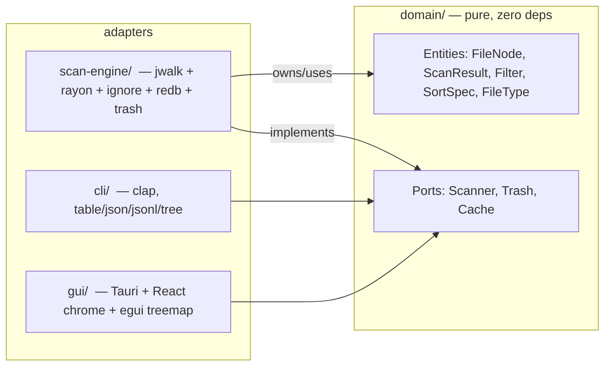

# DiskScope — Plan

> Approved scope: requirements.md. Build order = the `Phase N` headings below
> (parsed by `tests/pipeline.sh extract_phases`). Every phase is independently
> buildable, testable, and reviewable. Each lists **Deliverables**, **Tests**
> (`should <behavior> when <condition>`), and **Gates satisfied**.

---

## 0. Problem & Goal

**Problem.** Users (developers, power users) have no fast, free, cross-platform
GUI tool to see where disk space is going and safely clean it up. Existing
tools are paid (DaisyDisk), platform-specific (WinDirStat, GrandPerspective),
or terminal-only (ncdu).

**Goal.** Ship DiskScope v1: a free, OSS, cross-platform disk space analyzer
that parallel-scans ~100k files in <2 s, renders an interactive treemap, and
safely moves files to system trash with undo — on Linux, macOS, Windows.

**Hexagonal layout.** `domain` (pure types + ports, zero external deps) ←
`scan-engine` (FS / trash / cache adapters on those ports) ← `gui` (Tauri +
React + egui) + `cli` (clap).

---

## Architecture (hexagonal)

| Crate       | Role                  | Depends on                |
|-------------|-----------------------|---------------------------|
| `domain`    | Entities + ports      | (zero external deps)      |
| `scan-engine` | FS adapter, cache, trash, filters, output formats | `domain` |
| `cli`       | clap binary           | `domain`, `scan-engine`   |
| `gui`       | Tauri+React+egui bin  | `domain`, `scan-engine`   |

> **Workspace shape:** requirements.md states "3 crates (scan-engine, gui, cli)";
> we split the pure domain layer into its own crate to enforce hexagonal
> isolation (zero external deps, ports as traits). The "3 crates" in the
> requirements refers to the *adapter* crates. This reconciliation is
> restated verbatim in the root `Cargo.toml` (`# domain is pure domain
> crate (zero deps), 3 adapter crates per requirements`) and README so
> reviewers don't misread `domain` as an adapter crate.

> **Pinned versions (GUIDELINES floor):** Tauri v2.1, React 18.3,
> TypeScript 5.5, Vite 6.0, egui 0.31 + egui_extras, rayon 1.10, jwalk 0.6,
> ignore 0.4, redb 2.1, clap 4.5, trash 4.0, ably 1.0 (feature-gated).
> `Cargo.lock` is committed; `cargo` may resolve newer semver-compatible
> releases (e.g. current lockfile has redb 4.2, trash 5.2, jwalk 0.9).
> Where the plan cites a crate without a version, it means "as locked".
>
> **Breaking-API upgrades across lockfile floors:** GUIDELINES floors (e.g.
> redb 2.1) and the locked versions (redb 4.x) can differ by a breaking
> API — `redb 2.x → 4.x` changes the bincode table schema. The cache table
> therefore carries a `schema_version` key; on deserialize error or
> version mismatch, `Cache::get` treats the entry as a miss and rewrites
> the table (migrate-or-invalidate), so an old DB file after a `cargo
> update` can never panic or serve stale scans. Implemented in Phase 2.

**Architecture justification**
- **Rust** over Go/C++/Zig: memory safety + zero-cost abstractions for the
  parallel-scan hot path (requirement: 100k files <2 s, <200 MB).
- **Tauri v2** over Electron: smaller binary, less memory (constraint).
- **Hexagonal** isolation: domain testable with zero external deps; adapters
  (`scan-engine`, `cli`, `gui`) swappable behind ports (requirement: domain
  pure, adapters at edges).
- **egui** for the treemap: immediate-mode canvas rendering suited to
  canvas-heavy views; WASM-in-webview risk mitigated by the documented
  Canvas2D fallback with explicit go/no-go gate (Phase 4).

**Critical paths**
- Scan: `GUI/CLI → scan_engine::Scanner::scan → jwalk+rayon+ignore → ScanResult`
- Delete: `GUI/CLI → scan_engine::Trash::move_to_trash → trash crate`
- Cache: `scan_engine::Cache (redb) keyed by canonicalized (path, mtime, size)`

**Constraints (from GUIDELINES + requirements)**
- Rust 2021, `#![deny(clippy::all)]`, `#![deny(missing_docs)]`, no `unwrap()`
  in production paths.
- No paid deps, no Electron, no telemetry, offline-first.
- TDD: test first, then implement, then refactor, then commit. One logical
  change per commit. Conventional commits.

---

## Phase 1: Workspace Scaffold + Domain Core

**Scope.** Stand up the Cargo workspace (root `Cargo.toml`, three member
crates), consolidate the existing `domain/` crate (already ~660 LoC of types
+ ports + unit tests from the prior session) and bring it to production
quality. No scanning, no UI, no I/O. Zero external deps. Pure-Rust only.

### Deliverables
- `Cargo.toml` (workspace root): `[workspace] members = ["domain",
  "scan-engine", "cli", "gui"]`, resolver = "2", shared `rust-version`,
  shared MSRV = "1.77" (Tauri v2.1 / egui 0.31 require ≥1.77; pinned
  deliberately in Phase 1 and verified by `cargo check --workspace` on the
  Linux CI image before the phase is marked done).
- `domain/Cargo.toml`: package metadata; `[lib]`; **no** runtime deps.
- `domain/src/lib.rs`: keep and harden the existing `FileType`, `DomainError`,
  `FileNode`, `ScanResult`, `Filter`, `SortSpec`, `format_size`; add
  `skipped: Vec<PathError>` to `ScanResult` (walk errors such as
  permission-denied subtrees; never aborts a scan).
- `domain/src/ports.rs`: keep and harden `Scanner`, `Trash`, `Cache` traits.
- `domain/src/lib.rs` `#![deny(missing_docs)]`, `#![deny(clippy::all)]`,
  `#![forbid(unsafe_code)]`.
- Empty `scan-engine/`, `cli/`, `gui/` placeholder crates wired into the
  workspace (real implementation deferred to later phases).
- `.gitignore` updated: `/target`, `*.db`, `*-wal`, `*-shm`, `dist/`,
  `node_modules/`, `.env`.

### Tests (`should <behavior> when <condition>`)
Domain (unit, no I/O):
- `should classify FileType::Audio when extension is mp3` (and one per
  audio/video/image/doc/code/archive/other family).
- `should classify FileType::Other when extension is unknown`.
- `should reject empty path when FileNode::new called with empty string`.
- `should aggregate parent size from children when ScanResult::with_children
  built from child nodes`.
- `should report zero files when ScanResult empty`.
- `should keep entry when Filter::matches accepts the FileNode`.
- `should drop entry when Filter::matches rejects by min_size`.
- `should drop entry when Filter::matches rejects by max_age`.
- `should drop entry when Filter::matches rejects by name pattern`.
- `should drop entry when Filter::matches rejects by FileType set`.
- `should sort ascending when SortSpec::apply called with Ascending`.
- `should sort descending when SortSpec::apply called with Descending`.
- `should render "1.0 KiB" when format_size called with 1024`.
- `should render "1.5 MiB" when format_size called with 1.5*1024*1024`.
- `should render "0 B" when format_size called with 0`.
- `should carry source io error when DomainError::Io returned with context`.

Ports (unit, mock impls already in `ports.rs`):
- `should return canned ScanResult when Scanner::scan called via mock`.
- `should record path when Trash::move_to_trash called`.
- `should pop last recorded path when Trash::undo_last called`.
- `should return cached ScanResult when Cache::get called with known key`.
- `should return None when Cache::get called with unknown key`.
- `should evict entry when Cache::invalidate called`.

Build infra (Gate 1):
- `should compile domain on its own when cargo check -p domain`.
- `should compile the workspace when cargo check --workspace` (the three
  placeholder crates compile with `fn main() {}` / `pub fn lib()`).
- `should pass cargo test --workspace` (Gate 1 minimum).

### Gates satisfied
- **Gate 0:** this plan itself, plus the workspace skeleton being
  reviewable as "domain layer is correct and dep-free".
- **Gate 1:** `cargo check -p domain` and `cargo test -p domain` green.
- **Gate 2:** critic reviews the diff for `Cargo.toml` + `domain/` only;
  small surface, easy to PASS.
- Gate 3 N/A (no UI yet).

### Out of scope here
- All FS scanning, caching, trash, filters execution, formats — Phase 2.
- Any CLI or GUI surface — Phases 3 and 4.

---

## Phase 2: Scan Engine Adapter

**Scope.** Implement the `domain` ports (`Scanner`, `Trash`, `Cache`) as a
real adapter using `jwalk` (parallel walk) + `rayon`, `ignore` (.gitignore
respect), `redb` (embedded cache), `trash` (cross-platform move-to-trash).
Plus filters/sort/output formats/incremental scan. CLI/GUI don't exist yet —
this phase is exercised by **integration tests** against a real temp
directory tree.

- `scan-engine/Cargo.toml`: deps `jwalk`, `rayon`, `ignore`, `redb`,
  `trash`, `walkdir` (fallback: single-threaded walk used only when
  `RAYON_NUM_THREADS=1` is explicitly set), `serde` + `serde_json`,
  `thiserror`, `tempfile` (dev).
- `scan-engine/src/scanner.rs`:
  - `pub struct JwalkScanner` impl `Scanner` — parallel walk via `jwalk`,
    respecting `ignore::gitignore` rules, fills `ScanResult`.
  - Incremental: when `Cache::get(path)` returns a hit AND root mtime/size
    unchanged → reuse; else rescan subtree; persist results. Cache entry
    expiry is governed by a named constant `CACHE_TTL_SECS = 3600`
    (module-level, `u64`); entries older than the TTL are treated as a miss
    and rescanned. TTL applies to the whole entry — there is no per-subtree
    expiry; this is deliberate (single-key-per-root invalidation) and
    documented in the `cache.rs` module doc.
  - Cache keys are canonicalized: absolute, trailing separator stripped
    (dedupe `./`/`..`), so `foo/` ≡ `foo`. Case normalization is
    **platform-dependent and explicit**: on Windows/macOS (case-insensitive
    FS) the canonical key is lowercased (`to_ascii_lowercase`); on Linux
    it is preserved. The rule lives in one `canonicalize_key(path)`
    function so case-variant paths never produce distinct keys on
    case-insensitive FS (which would defeat invalidation). Limitation
    documented in code: `to_ascii_lowercase` is deliberate — full Unicode
    case-folding (e.g. `ß`/`SS`) is out of scope for MVP file paths; the
    function name and doc comment state ASCII-only folding.
  - **Dependency injection:** `JwalkScanner`/`RedbCache`/`TrashBin` are
    never referenced by name in `cli`/`gui`. Those binaries depend only on
    the `domain::ports` traits (`Scanner`, `Cache`, `Trash`) and receive a
    concrete `ScanService` (adapter-layer composition) injected at startup
    — keeps the domain←adapter dependency arrow clean in code.
    Permissions/symlink errors are recorded in `ScanResult::skipped`, never
    fatal.
- `scan-engine/src/cache.rs`:
  - `pub struct RedbCache` impl `Cache` using `redb` embedded DB
    (`tables: scans (key: path, value: (mtime, size, ScanResult bincode))`,
    plus a `schema_version` key — see the lockfile-drift note in
    Architecture; on version mismatch or deserialize error the table is
    invalidated and rebuilt),
    plus the `CACHE_TTL_SECS` constant above.
  - `invalidate(path)` removes the key (and any child prefixes via range
    delete — exact prefix scan needed for rescan correctness).
  - **Multi-process safety (CLI + GUI concurrent):** redb allows one writer
    per DB file, so the cache is opened write-once with exclusive ownership;
    on `lock_error`, reopen read-only (cache reads still work, writes are
    skipped for that session). The write-skip is **never silent**: the
    session surfaces a typed `DomainError::CacheUnavailable` once, which
    the CLI prints to stderr (exit code unchanged) and the GUI shows as a
    toast/log line in the status bar. **No long-lived stale cache:** the
    read-only mode is a fallback, not a session default — if the other
    writer is gone, the next `Cache::get` (triggered by the next
    `scan()`) retries the write-open once before serving; only if the
    lock is still held does the session stay read-only, and the surfaced
    `CacheUnavailable` message says "restart to re-enable writes" (shown
    in the GUI status bar tooltip / CLI stderr line). Undo journal
    (Phase 2) uses the same policy.
- `scan-engine/src/trash.rs`:
  - `pub struct TrashBin` impl `Trash` backed by `trash` crate; maintains
    a **persisted undo journal** (same redb file) of
    `(original_path, trashed_item_id)`, so `undo_last()` survives app
    restart/crash; journal entry is removed after successful restore.
- `scan-engine/src/filters.rs`: `pub fn apply_filter(result: &ScanResult,
  filter: &Filter) -> ScanResult`.
- `scan-engine/src/sort.rs`: `pub fn apply_sort(entries: &mut [FileNode],
  spec: SortSpec)`.
- `scan-engine/src/formats.rs`: `pub enum OutputFormat { Table, Json,
  Jsonl, Tree }` + `pub fn render(result: &ScanResult, fmt: OutputFormat,
  out: &mut dyn Write)`.
- `scan-engine/src/lib.rs`: re-exports + the `pub struct ScanService` that
  composes `Scanner` + `Cache` + `Filter` + `Formatter` for use by cli/gui.
  Doc comment: *ScanService is the single entry point for CLI/GUI access to
  scan-engine — consumers never instantiate individual adapters directly.
  It is a convenience composition of scan-engine adapters (adapter-layer
  wiring); domain logic stays in `domain::*` traits. `cli`/`gui` never
  `use scan_engine::JwalkScanner` (or `RedbCache`/`TrashBin`) by name —
  they call `ScanService::new(impl Scanner, impl Cache, impl Trash)`, so a
  Gate 2 DI audit is a one-line grep.*
- `#![deny(clippy::all)]`, `#![deny(missing_docs)]`, no `unwrap()` in prod.
- Update `.gitignore` for any cache files the engine writes to temp dirs.

### Tests
Unit:
- `should skip node_modules when Scanner::scan hits a .gitignored path`.
- `should walk in parallel when Scanner::scan given a wide tree` (count
  threads spawned via env var `RAYON_NUM_THREADS=2`; **asserted via a
  thread-count/`AtomicUsize` probe in the walk callback, not wall-clock** —
  timing assertions are inherently flaky on CI; marked `#[ignore]` and run
  as a `--release` perf smoke).
- `should reuse cached scan when root mtime unchanged within CACHE_TTL_SECS`.
- `should rescan subtree when root mtime changed`.
- `should return hit when Cache::get called for known path`.
- `should return miss when Cache::get called after invalidate`.
- `should move path to trash when Trash::move_to_trash called`.
- `should restore previous path when Trash::undo_last called`.
- `should refuse undo when undo stack empty`.
- `should drop entry smaller than min_size when Filter applied`.
- `should keep only entries newer than max_age when Filter applied`.
- `should sort by size descending when SortSpec::Size Descending applied`.
- `should render valid JSON when format is Json`.
- `should render one JSON object per line when format is Jsonl`.
- `should render tree indentation when format is Tree`.
- `should render aligned columns when format is Table`.

Unit / integration additions (review findings):
- `should record permission-denied dir in skipped when Scanner::scan hits
  unreadable subtree` (chmod 000 on a child; scan completes, error surfaced).
- `should return same cache key for /tmp/a/./b and /tmp/a/b when
  canonicalize_key called`.
- `should restore entry after process restart when undo journal replayed`
  (simulate restart: drop in-memory stack, rebuild from journal).
- `should open read-only and skip writes when cache file already open by
  another writer` (second handle on same DB; scans still served from
  memory).
- `should retry write-open and recover when lock released before next
  scan` (drop first writer, re-scan, assert writes resume — no stale
  cache across sessions).
- `should invalidate and rebuild table when schema_version mismatches`
  (old-format DB file; `Cache::get` returns miss, rescan rewrites).
- `should detect deletion when incremental scan re-runs after removing
  half the files`.
- `should detect new files when incremental scan re-runs after adding files`.
- `should keep memory under 200 MB when Scanner::scan runs against 100k
  synthetic files` (best-effort: rss sample before/after; performance
  constants named `SCAN_TARGET_FILES = 100_000`, `SCAN_TARGET_MS = 2000`,
  `SCAN_MAX_RSS_MB = 200` in `scan-engine`).

### Gates satisfied
- **Gate 1:** `cargo test -p scan-engine` green (unit + integration).
- **Gate 2:** critic reviews only the scan-engine diff; portability,
  parallel correctness, cache invalidation, no-`unwrap()` are checkable
  in a bounded diff.
- Gate 0 / Gate 3 N/A here.

### Out of scope here
- CLI binary (Phase 3).
- GUI (Phase 4).
- Ably sync (Phase 5).

---

## Phase 3: CLI

**Scope.** Thin clap binary that consumes `scan-engine`. No new domain
logic; no UI.

### Deliverables
- `cli/Cargo.toml`: deps `clap` (derive), `anyhow` (CLI boundary only —
  domain stays pure), `scan-engine`, `domain`.
- `cli/src/main.rs`:
  - `diskscope scan [path] [--format table|json|jsonl|tree] [--filter ...]
    [--sort ...] [--no-cache] [--follow-symlinks]`
  - `diskscope summary <path>` — calls `Scanner::scan`, prints total size,
    file count, top-10 largest entries.
  - `diskscope completions <shell>` — `clap_complete` for bash/zsh/fish/powershell.
  - `diskscope delete <path> [--undo]` — `Trash::move_to_trash` /
    `Trash::undo_last`.
  - Exit codes: 0 = ok, 2 = usage error, 3 = I/O error, 5 = not found.
- `cli/tests/cli.rs`: integration tests using `assert_cmd`.

### Tests
Unit (small wrappers):
- `should pick Table format by default when scan invoked without --format`.
- `should pick Json format when --format json passed`.
- `should reject unknown format when --format xml passed`.
- `should print total + count + top10 when summary invoked`.

Integration (`assert_cmd`):
- `should emit JSON array when scan --format json runs against fixture tree`.
- `should emit one JSON line per file when scan --format jsonl runs`.
- `should emit tree-style output when scan --format tree runs`.
- `should print nothing on stdout and exit 0 when --quiet passed`.
- `should print to stderr and exit 2 when no path given`.
- `should move file to trash when delete invoked against a real file` (uses
  `assert_cmd` + tempfile; verify file gone from original, present in trash
  via `trash` crate listing).
- `should restore file when delete --undo runs after a delete`.
- `should emit bash script when completions bash invoked`.

### Gates satisfied
- **Gate 1:** `cargo test -p cli` + `cargo test --workspace` green.
- **Gate 2:** critic reviews CLI diff only; thin-controller pattern is
  trivially checkable.
- Gate 0 / Gate 3 N/A.

### Out of scope
- GUI (Phase 4).
- Sync / packaging (Phase 5).

---

## Phase 4: GUI (Tauri + React + egui treemap)

**Scope.** Desktop app. React owns chrome (toolbar, sidebar, settings);
egui (in a `<canvas>` via Tauri webview) owns the treemap + table for
canvas-heavy rendering. Tauri commands wire the GUI to `scan-engine`.
No Ably sync yet (Phase 5). All keyboard shortcuts and context menu wired.

### Deliverables
- Root `package.json` (Vite workspace) — only when phase 4 builds.
- `gui/Cargo.toml`: deps `tauri` v2, `tauri-build`, `serde`, `serde_json`,
  `domain`, `scan-engine`.
- `gui/tauri.conf.json`: window, allowlist, single bundle per platform later.
- `gui/src-tauri/src/main.rs`: Tauri entrypoint.
- `gui/src-tauri/src/commands.rs`: `#[tauri::command]`s
  - `start_scan(path: String, filter: Option<Filter>, tx: tauri::State<…>) ->
    ScanId`
  - `cancel_scan(scan_id: ScanId) -> ()`
  - `delete_paths(paths: Vec<String>) -> ()`
  - `undo_last_delete() -> ()`
  - `reveal_in_explorer(path: String) -> ()` (cross-platform via the
    `opener` crate v5.x, which handles platform detection internally).
- `gui/src-tauri/src/scan_runner.rs`: `ScanRunner` is an explicit state
  machine over `Idle → Running → Done/Cancelled → Idle`. A running scan
  owns an immutable snapshot of `ScanResult` (via `Arc`) so
  `delete_paths`/`undo_last_delete`/`reveal_in_explorer` never read a
  partially-written tree; mutations are rejected with a typed error while
  a scan is `Running`, and `cancel_scan` on a `Done` scan is a no-op
  returning the current `ScanId`. Background-thread scan streams progress
  via Tauri events (`scan-progress`, `scan-done`) so UI stays responsive.
- `gui/web/`:
  - `package.json`, `vite.config.ts`, `tsconfig.json` (strict),
    `.eslintrc.json` (`@typescript-eslint/no-explicit-any: error`,
    `@typescript-eslint/no-unused-vars: error`),
  - `index.html`, React 18 entry, design tokens imported from
    `design-system/tokens.json` (no hard-coded colors / spacing),
  - `src/main.tsx`, `src/App.tsx`,
  - `src/components/`: `Sidebar.tsx`, `Toolbar.tsx`, `FilterPanel.tsx`,
    `TreemapCanvas.tsx` (mounts an `<canvas>` and runs an egui app inside
    via `egui-wgpu` / WASM bridge — if the WASM-egui route is too heavy,
    fall back to a pure-Canvas2D treemap driven by `domain::ScanResult`),
    `TreemapCanvas2D.tsx` (the Canvas2D fallback, built and exercised in
    the same phase, sharing `treemap-layout` + the same IPC contract as the
    WASM-egui route; selected at build time behind a feature flag),
    `TableView.tsx` (sortable columns: name, size, modified, type),
    `ContextMenu.tsx` (open in explorer, copy path, copy relative path),
    `StatusBar.tsx`.
  - egui-WASM go/no-go gate: after the first successful WASM-egui
    integration, measure (a) binary size delta >10 MB, (b) treemap render
    time >100 ms for 10k nodes, or (c) build-time increase >60 s. If any
    trigger fires, switch to pure Canvas2D with the `treemap-layout` pure
    function. Chosen route is documented in the Phase 4 commit message.
  - `src/hooks/useScan.ts`, `useSelection.ts`, `useShortcuts.ts`
    (arrows/enter/backspace/Delete/Cmd/Ctrl+Z).
  - `src/ipc.ts`: typed wrapper around `invoke()` for the Tauri commands.
    **IPC contract versioning:** every command payload carries a
    `protocol_version: 1` field (in a shared `IpcEnvelope<T>`);
    `commands.rs` rejects mismatched versions with a typed error instead
    of deserializing garbage. Bumping `protocol_version` is mandatory when
    any `domain` type in the payload changes shape — prevents silent
    desync between Rust `serde` types and TypeScript `strict` types.
  - Vitest unit tests for hooks + pure components.
- `tests/e2e/` (Playwright spec for Gate 3):
  - `playwright.config.ts`
  - `treemap.spec.ts`: launch app via Tauri's webview dev mode, scan a
    fixture dir, assert treemap renders, hover/click navigates,
    `Delete` key moves to trash, `Cmd/Ctrl+Z` restores.

### Tests
Domain-driven hooks (`vitest`):
- `should debounce filter changes when filter input updates rapidly`.
- `should dispatch scan IPC when StartScan invoked`.
- `should cancel running scan when CancelScan invoked`.
- `should sort entries by size descending when header clicked twice`.

egui / treemap rendering (`vitest` + jsdom, with a `treemap-layout` pure
function):
- `should allocate area proportional to size when layout called with
  ScanResult`.
- `should color by FileType when layout called`.
- `should reveal hovered entry when layout called with hover index`.

Playwright (Gate 3 functional):
- `should render treemap after scan completes when app scans a fixture dir`.
- `should navigate into directory when entry double-clicked`.
- `should move selected entry to trash when Delete pressed`.
- `should restore trashed entry when Cmd/Ctrl+Z pressed`.
- `should open OS file explorer when "Reveal" context item clicked`.
- `should copy path when "Copy Path" context item clicked`.

Performance smoke:
- `should scan 10k-file fixture and render treemap under 5 s when GUI run
  on developer machine` (manual assertion in CI log, not a hard test).

### Gates satisfied
- **Gate 1:** `cargo test --workspace` + `pnpm test` (vitest) green.
- **Gate 2:** critic reviews GUI diff (Tauri commands, hooks, treemap
  layout, IPC contract).
- **Gate 3:** Playwright spec passes; vision model reviews screenshots for
  visual correctness against `design-system/tokens.json`. First time
  visual gate applies.

### Out of scope
- Ably sync (Phase 5).
- Code signing, notarization, AppImage/deb/rpm packaging pipelines (Phase 5).

---

## Phase 5: Real-Time Sync (Ably) + Cross-Platform Packaging

**Scope.** Sync layer + packaging. The app already works offline; Phase 5
adds optional cloud sync and the shipping artifacts.

### Deliverables
- `scan-engine/Cargo.toml`: optional `ably` feature behind a feature flag
  (`#[cfg(feature = "sync")]`); no impact on offline-first build.
- `scan-engine/src/sync.rs` (feature-gated):
  - `pub struct AblySyncer` — owns an `ably` client, a channel per scan
    root, and a publisher that streams file events.
  - Conflict resolution: last-write-wins by `(path, mtime)` timestamp, with
    **deletion tombstones** and **per-device monotonic tie-break**
    (`(device_id, mtime)`) to avoid clock-skew and same-mtime resurrection
    of deleted files.
- `gui/src-tauri/src/commands.rs`: `enable_sync`, `disable_sync`,
  `set_sync_api_key` (stored in OS keyring via `keyring` crate, never
  written to disk in plaintext).
- `gui/web/src/components/SyncStatus.tsx`: small pill in toolbar showing
  online/offline + last-sync time; when no API key is configured the pill
  renders a disabled "Sync off" state with a tooltip pointing to
  Settings — never prompts, never auto-enables.
- `.github/workflows/release.yml`:
  - matrix: ubuntu-latest (AppImage, .deb, .rpm, .tar.gz), macos-latest
    (.dmg, notarize stub), windows-latest (.msi, portable .exe).
  - uses `tauri-action`.
  - attaches artifacts to GitHub Release.
- `gui/tauri.conf.json`: updater config (`tauri-plugin-updater`), bundle
  targets per platform, signing placeholders.
- `docs/RELEASING.md`: how to sign + notarize; secrets required.

### Tests
Unit:
- `should not include ably in dependency graph when sync feature disabled`.
- `should serialize a file event when publisher called`.
- `should pick newer mtime when local and remote event conflict`.
- `should keep deletion when local mtime newer than remote write` (tombstone
  precedence; no delete resurrection).
- `should break mtime ties by device_id when two events share mtime`.
- `should refuse to start sync when API key missing`.
- `should not write key to disk when set_sync_api_key called` (assert
  `keyring::Entry::get_password` works and no plaintext on FS).

Integration:
- `should round-trip scan result when two AblySyncer instances exchange
  events on the same channel` (uses `ably` test account or mock transport).

Playwright (Gate 3 visual):
- `should show "Synced" pill when sync enabled and connected`.
- `should show "Offline" pill when network disabled`.

Packaging (Gate 1 / smoke):
- `cargo tauri build` produces a `.dmg` on macOS runner.
- `cargo tauri build` produces `.msi` + `.exe` on Windows runner.
- `cargo tauri build` produces `.AppImage`, `.deb`, `.rpm` on Linux runner.
  (These are CI smoke checks; if a target runner is unavailable in this
  environment, the workflow step is `continue-on-error` with a tracked
  note — does not block Gate 1.)

### Gates satisfied
- **Gate 1:** workspace tests still green with `sync` feature on and off.
- **Gate 2:** critic reviews sync + packaging diff.
- **Gate 3:** final visual review of synced state, offline state, packaged
  app window.

### Out of scope
- Pro features (network drives, scheduled scans, cloud storage index,
  team workspaces, hooks) — explicitly post-MVP per requirements.md.

---

## Risks & Mitigations

| Risk | Likelihood | Impact | Mitigation |
|---|---|---|---|
| `jwalk` + `ignore` interaction for symlinks causes infinite loops | Medium | High | Cap walk depth; refuse to follow symlinks by default (`--follow-symlinks` opt-in); integration test with cyclic symlink fixture. |
| `redb` write contention on incremental scan | Medium | Medium | Single-writer thread; read-only snapshots for GUI; cache file lives in user data dir, never in scanned tree. |
| `egui` in Tauri webview via WASM is heavyweight (binary size, build time) | Medium | Medium | Fall back to pure Canvas2D treemap driven by a `treemap-layout` pure function in `gui/web`; documented in Phase 4 deliverables. |
| Same-model critic leniency (MiMo=MiMo) | Medium | Medium | Per-phase small diffs (PIPELINE_AUDIT note #1); escalate to Gate 3 vision review for UI; track P2+ notes for human. |
| Tauri v2 webview + system webkit/gtk ABI mismatch on Linux CI | High | High | docker_preflight in `pipeline.sh` already builds a toolchain image with webkit2gtk; document required `apt` packages. |
| Ably account / API key required for Gate 3 sync test | Medium | Low | Sync feature is `#[cfg(feature = "sync")]`; tests use mocked transport when key absent; CI step is `continue-on-error` if no key in env. |
| LWW sync: clock skew / same-mtime conflicts resurrect deleted files | Medium | Medium | Per-device monotonic tie-break + deletion tombstones (Phase 5); conflict events still surfaced in UI. |
| Concurrent CLI + GUI open the same redb cache file | Medium | Medium | Write-once open; on `lock_error` reopen read-only and skip writes for the session (Phase 2). |
| 100k files <2 s target on slow CI runners | Low | Medium | Performance gate is dev-machine + manual log assertion, not a hard CI test; documented. |

---

## Quality Compliance Checklist (Karpathy + Ponytail)

- [x] Hexagonal — `domain` has **zero** external deps; ports are traits in
  `domain`; adapters in `scan-engine`/`cli`/`gui`.
- [x] Types — `#![deny(missing_docs)]`, `#![deny(clippy::all)]`, every
  public symbol documented.
- [x] No `unwrap()` in production paths — enforced by clippy +
  `concise-code-comments`/`karpathy-guidelines` skills.
- [x] TDD — every test listed above in build order; one
  test → implement → refactor → commit.
- [x] Tests as docs — `should <behavior> when <condition>` naming.
- [x] Conventional commits, one logical change per commit.
- [x] `.gitignore` updated as artifacts (redb, dist, node_modules) appear.
- [x] No `any`/`unwrap` as a substitute for proper error handling — every
  port returns `Result<T, DomainError>`; CLI boundary uses `anyhow`.
- [x] Anyhow boundary — `anyhow` is used **only** in `cli/src/main.rs`
  (CLI boundary); all library code (`domain`, `scan-engine`, `gui`)
  returns typed `Result<T, DomainError>`. No leakage.
- [x] TypeScript strictness — `gui/web/tsconfig.json` has
  `strict: true`, `noImplicitAny: true`; no `// @ts-ignore` without
  justification; ESLint `@typescript-eslint/no-explicit-any` enabled.

---

## Build Order (matches phase headings the pipeline parses)

1. Phase 1: Workspace Scaffold + Domain Core
2. Phase 2: Scan Engine Adapter
3. Phase 3: CLI
4. Phase 4: GUI (Tauri + React + egui treemap)
5. Phase 5: Real-Time Sync (Ably) + Cross-Platform Packaging

Each phase is independently buildable, testable, and reviewable.