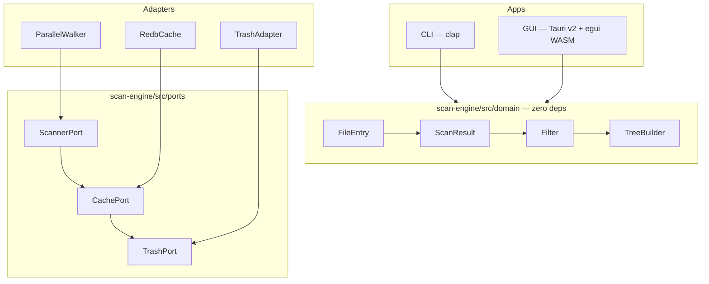

# DiskScope — Build Plan

## 1. Problem & Goal

**Problem:** Developers, power users, and sysadmins need a fast, cross-platform disk space
analyzer. Existing tools are paid (DaisyDisk), platform-specific (WinDirStat), slow (ncdu),
or lack a modern GUI.

**Goal:** A free, open-source disk analyzer that scans 100k files in <2s, displays an
interactive treemap, supports safe delete with undo, and runs on Linux/macOS/Windows as a
single binary.

---

## 2. Architecture

### 2.1 High-Level



### 2.2 Module Boundaries

| Module | Crate | Responsibility | Depends On |
|---|---|---|---|
| `domain` | `scan-engine` | `FileEntry`, `ScanResult`, `TreeBuilder`, filters, sort, formatters | **nothing** |
| `ports` | `scan-engine` | Traits: `Scanner`, `Cache`, `Trash` | `domain` only |
| `adapters` | `scan-engine` | `ParallelWalker` (rayon+jwalk), `RedbCache`, `TrashAdapter` | `domain`, `ports`, external crates |
| `cli` | `diskscope-cli` | clap CLI: `scan`, `summary`, `completions` | `scan-engine` |
| `gui` | `diskscope-gui` | Tauri v2 + egui WASM treemap, table, filters, trash | `scan-engine` |

### 2.3 Key Ports (Traits)

```rust
pub trait Scanner {
    fn scan(&self, root: &Path, opts: &ScanOptions) -> Result<ScanResult, ScanError>;
}

pub trait Cache {
    fn get(&self, path: &Path) -> Option<CachedEntry>;
    fn put(&self, entry: &CachedEntry);
    fn evict_stale(&self, root: &Path) -> usize;
}

pub trait Trash {
    fn delete(&self, paths: &[PathBuf]) -> Result<Vec<TrashedFile>, TrashError>;
    fn undo(&self, files: &[TrashedFile]) -> Result<(), TrashError>;
}
```

### 2.4 Data Flow

```
CLI/GUI → ScanEngine::run(root, opts)
  → Scanner::scan() → parallel walk → Vec<FileEntry>
  → Cache::evict_stale() + Cache::put() for new entries
  → TreeBuilder::build(entries) → ScanResult (tree + stats)
  → Filter::apply(result, filters) → filtered result
  → Formatter::to_json|table|tree → output
```

---

## 3. Phased Build Plan

### Phase 0: Workspace & Domain Core

**Deliverables:**
- Root `Cargo.toml` workspace with members `scan-engine`, `cli`, `gui`
- `scan-engine/src/lib.rs` — domain types: `FileEntry`, `ScanResult`, `NodeType`,
  `ScanOptions`, `FilterSpec`, `SortKey`, `SortDir`
- `scan-engine/src/tree.rs` — `TreeBuilder::build(Vec<FileEntry>) -> ScanResult`
- `scan-engine/src/filter.rs` — `Filter::apply(ScanResult, FilterSpec) -> ScanResult`
- `scan-engine/src/format/` — `table`, `json`, `jsonl`, `tree` formatters
- `scan-engine/src/ports.rs` — `Scanner`, `Cache`, `Trash` trait definitions
- Domain-level `Display` + `Error` impls for `ScanError`, `TrashError`
- Zero external deps in domain module (verified by `cargo tree`)

**Tests (in TDD order):**

| # | Test | Type |
|---|---|---|
| 1 | should create FileEntry with valid fields when given path, size, mtime, node_type | unit |
| 2 | should build tree with correct parent-child nesting when given flat entry list | unit |
| 3 | should calculate total_size and entry_count when tree has mixed file and dir nodes | unit |
| 4 | should apply size filter when min_size specified | unit |
| 5 | should apply file_type filter when types list provided | unit |
| 6 | should apply name pattern filter when glob pattern given | unit |
| 7 | should apply age filter when max_age_days specified | unit |
| 8 | should chain multiple filters when all specified | unit |
| 9 | should format ScanResult as aligned table when format=table | unit |
| 10 | should format ScanResult as JSON when format=json | unit |
| 11 | should format ScanResult as JSONL (one entry per line) when format=jsonl | unit |
| 12 | should format ScanResult as indented tree when format=tree | unit |
| 13 | should sort by size descending when sort_key=size, sort_dir=desc | unit |
| 14 | should sort by name ascending when sort_key=name | unit |

**Gates satisfied:** Gate 0 (plan), Gate 1 (unit tests green)

---

### Phase 1: Scan Engine Adapters

**Deliverables:**
- `scan-engine/src/walk.rs` — `ParallelWalker` impl of `Scanner` using rayon + jwalk
  - Respects `.gitignore` via `ignore` crate
  - Collects `FileEntry` from parallel walk
  - Configurable max depth
- `scan-engine/src/cache.rs` — `RedbCache` impl of `Cache` using redb
  - Stores `FileEntry` keyed by path
  - `evict_stale` removes entries whose mtime < current scan mtime
  - Incremental scan: reuse cached entries for unchanged files
- `scan-engine/src/trash.rs` — `TrashAdapter` impl of `Trash` using `trash` crate
  - `delete` moves files to OS trash, returns `TrashedFile` (original path + trash handle)
  - `undo` restores from trash using handle
- `scan-engine/src/engine.rs` — `ScanEngine` orchestrator:
  - `run(root, opts) -> Result<ScanResult, ScanError>`
  - Drives Scanner → Cache → TreeBuilder pipeline
  - Incremental scan path (uses cache when available)
- Integration tests with real filesystem fixtures (tempdir)

**Tests (in TDD order):**

| # | Test | Type |
|---|---|---|
| 1 | should walk directory and return entries for all files when no filters | integration |
| 2 | should skip .gitignored files when walking repo directory | integration |
| 3 | should respect max_depth option when directory is deeply nested | integration |
| 4 | should cache entries and reuse them on re-scan when files unchanged | integration |
| 5 | should evict stale cache entries when file mtime changed | integration |
| 6 | should move file to OS trash when delete called | integration |
| 7 | should restore file from trash when undo called | integration |
| 8 | should return error when delete called on non-existent path | integration |
| 9 | should run full scan end-to-end with cache disabled | integration |
| 10 | should run incremental scan and only re-walk changed files | integration |
| 11 | should complete scan of 10k temp files in under 2 seconds when on SSD | perf |
| 12 | should stay under 200MB RSS when scanning 100k files | perf |

**Gates satisfied:** Gate 1 (integration + perf tests green)

---

### Phase 2: CLI

**Deliverables:**
- `cli/src/main.rs` — clap-based CLI with subcommands:
  - `diskscope scan [path] --format table|json|jsonl|tree --sort size|name|modified --order asc|desc --min-size --max-depth --types --pattern`
  - `diskscope summary <path>` — quick total size + top-10 biggest entries
  - `diskscope completions <shell>` — shell completions (bash/zsh/fish/powershell)
- Error handling: typed `CliError` with user-friendly messages, non-zero exit on failure
- Progress indicator on stderr for long scans (optional, graceful degradation)
- CLI integration tests using `assert_cmd` or subprocess

**Tests (in TDD order):**

| # | Test | Type |
|---|---|---|
| 1 | should print table output when scan run with --format table | integration |
| 2 | should print valid JSON when scan run with --format json | integration |
| 3 | should print one JSON object per line when scan run with --format jsonl | integration |
| 4 | should print indented tree when scan run with --format tree | integration |
| 5 | should filter by --min-size when flag provided | integration |
| 6 | should limit depth when --max-depth provided | integration |
| 7 | should print top-10 summary when summary subcommand run | integration |
| 8 | should generate completions script when completions subcommand run with bash | integration |
| 9 | should exit 1 with error message when scan path doesn't exist | integration |
| 10 | should sort by size descending by default when no sort flags given | integration |

**Gates satisfied:** Gate 1 (CLI integration tests green), Gate 2 (adversarial review of
domain + engine + CLI)

---

### Phase 3: GUI — Treemap & Table

**Deliverables:**
- `gui/src-tauri/` — Tauri v2 backend: IPC commands (`scan`, `stop`, `delete`, `undo`,
  `get_filters`, `set_filters`) wrapping `ScanEngine`
- `gui/src/` — React 18 + TypeScript + Vite frontend:
  - `ScanView` — egui WASM canvas showing interactive treemap (squarified layout)
  - `TableView` — sortable table with columns: name, size, modified, type
  - `FilterBar` — size range slider, type checkboxes, age dropdown, name pattern input
  - `ContextMenu` — open in explorer, copy path, copy to clipboard
  - `Toolbar` — start/stop scan, format toggle (treemap/table), breadcrumb path
- Keyboard shortcuts: arrows navigate, Enter drill down, Backspace go up, Delete trash,
  Ctrl/Cmd+Z undo
- egui integration: React hosts a `<canvas>`, egui WASM renders treemap inside it
- State: React manages chrome (toolbar, filters), egui manages canvas (treemap interaction)

**Tests (in TDD order):**

| # | Test | Type |
|---|---|---|
| 1 | should render treemap with rectangles proportional to file sizes when scan result loaded | e2e |
| 2 | should highlight treemap cell on hover when mouse enters rect | e2e |
| 3 | should drill into directory when treemap cell clicked | e2e |
| 4 | should sort table by size when column header clicked | e2e |
| 5 | should filter results when filter bar values changed | e2e |
| 6 | should move file to trash when Delete key pressed on selected item | e2e |
| 7 | should restore file when Ctrl+Z pressed after delete | e2e |
| 8 | should show context menu when right-click on treemap cell | e2e |
| 9 | should copy path to clipboard when "Copy Path" selected from context menu | e2e |
| 10 | should navigate up when Backspace pressed at subdirectory level | e2e |
| 11 | should display breadcrumb path when drilling into nested directory | e2e |

**Gates satisfied:** Gate 1 (e2e tests green), Gate 3 (Playwright + vision model
screenshots pass)

---

### Phase 4: Polish & Packaging

**Deliverables:**
- `gui/src-tauri/tauri.conf.json` — app metadata, updater config, window defaults
- CI workflow (`.github/workflows/release.yml`) — build matrix for Linux/macOS/Windows
- Platform artifacts: `.dmg`, `.msi`, `.AppImage`, `.deb`, `.rpm`, `.tar.gz`
- README.md — real app README (not pipeline docs)
- `CHANGELOG.md` — initial release notes
- Code signing setup: macOS Developer ID, Windows EV cert (config, not actual certs)
- Ably sync behind `sync` feature flag (optional, can defer to post-MVP)

**Tests (in TDD order):**

| # | Test | Type |
|---|---|---|
| 1 | should build release binary for linux-x64 when CI runs on ubuntu | ci |
| 2 | should build release binary for macos-universal when CI runs on macos | ci |
| 3 | should build release binary for windows-x64 when CI runs on windows | ci |
| 4 | should produce .deb artifact when linux release build completes | ci |
| 5 | should produce .dmg artifact when macos release build completes | ci |
| 6 | should produce .msi artifact when windows release build completes | ci |

**Gates satisfied:** Gate 1 (CI tests green), Gate 2 (final adversarial review of full
codebase), Gate 3 (visual E2E on packaged binary)

---

## 4. Dependency Matrix

| Crate | Key Dependencies | License |
|---|---|---|
| `scan-engine` | `rayon`, `jwalk`, `ignore`, `redb`, `trash`, `globset`, `serde`, `serde_json` | all MIT/Apache-2.0 |
| `diskscope-cli` | `clap`, `indicatif` (optional progress), `scan-engine` | MIT/Apache-2.0 |
| `diskscope-gui` (Tauri backend) | `tauri`, `scan-engine` | MIT/Apache-2.0 |
| `diskscope-gui` (frontend) | `react`, `@types/react`, `vite`, `typescript`, `egui` (WASM) | MIT |

Domain module (`scan-engine/src/domain/`) has **zero** external dependencies — enforced
by `cargo tree -p scan-engine --depth 1` verification.

---

## 5. Risk Assessment

| Risk | Likelihood | Impact | Mitigation |
|---|---|---|---|
| egui WASM + React integration complexity | High | Medium | Phase 3 starts with pure egui canvas; React chrome is thin shell. Fallback: egui-only desktop app |
| redb cache corruption on crash | Low | High | WAL mode (redb default); cache is disposable — delete and re-scan |
| jwalk vs walkdir performance gap unclear | Medium | Low | Both behind `Scanner` trait; swap adapter if jwalk underperforms |
| Cross-platform trash API differences | Medium | Medium | `trash` crate handles this; test on all 3 platforms in CI |
| Tauri v2 WASM plugin maturity | Medium | High | Prototype egui-in-Tauri in Phase 3 spike before committing. Fallback: native egui desktop (no Tauri) |
| 100k files <2s target on HDD | Low | Medium | Benchmark in Phase 1; if missed, document "SSD recommended" |

---

## 6. Quality Gates Summary

| Gate | When | Criteria | Phase(s) |
|---|---|---|---|
| **Gate 0** | Before Phase 0 code | Plan reviewed by critic; architecture validates hexagonal, domain=zero-deps | — |
| **Gate 1** | After each phase | All tests for that phase green (`cargo test`, `pnpm test`, Playwright) | 0, 1, 2, 3, 4 |
| **Gate 2** | After Phase 2, Phase 4 | Adversarial code review by different model (critic); no P0/P1 findings | 2, 4 |
| **Gate 3** | After Phase 3, Phase 4 | Playwright e2e green + vision model screenshots pass | 3, 4 |

---

## 7. Ponytail & Karpathy Compliance

- [x] Hexagonal architecture — domain at center, adapters at edges
- [x] Domain has zero external deps
- [x] All public functions typed, no `any`/`Any`
- [x] TDD — tests listed in order, test-first per phase
- [x] Explicit types, small functions, no cleverness
- [x] No `unwrap()` in production code — `?` or `expect` with context
- [x] Conventional commits: `feat(scan):`, `fix(cli):`, etc.
- [x] One TDD cycle = one commit (or small related batch)
- [x] Cargo workspace with 3 crates, clean boundaries

---

## 8. Estimation

| Phase | Effort | Parallelizable |
|---|---|---|
| Gate 0: Plan review | 1 round | — |
| Phase 0: Domain core | Small (types + pure logic) | No |
| Phase 1: Scan engine adapters | Medium (walk/cache/trash + integration) | Walk and cache in parallel |
| Phase 2: CLI | Small (thin clap wrapper) | After Phase 1 |
| Phase 3: GUI | Large (treemap + table + shortcuts + Tauri IPC) | After Phase 1; spike first |
| Phase 4: Polish & CI | Medium (CI matrix + docs) | After Phase 3 |
| Gates 1–3 | Per phase | — |
| **Total** | ~MVP in 5 phases | Phases 0–1 are critical path |
