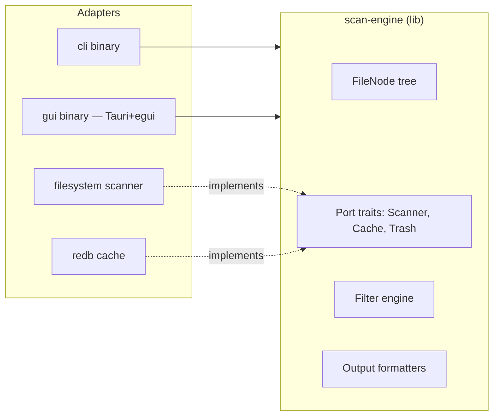

# DiskScope — Build Plan

## 1. PROBLEM & GOAL

**Problem:** Users lack a fast, free, cross-platform disk space analyzer with a modern interactive UI. Existing tools are paid, platform-specific, or slow.

**Goal:** A Rust-based disk analyzer that scans 100k files in <2s, displays an interactive treemap, supports safe-delete with undo, and ships as a single binary on Linux/macOS/Windows.

---

## 2. ARCHITECTURE

### 2.1 Hexagonal (Ports & Adapters)



### 2.2 Workspace Crates

| Crate | Type | Responsibility | External deps |
|---|---|---|---|
| `scan-engine` | lib | Domain entities, port traits, filter logic, output formatters, scan orchestrator | rayon, jwalk, ignore, redb, trash |
| `cli` | bin | CLI adapter (clap) | clap, serde_json, scan-engine |
| `gui` | bin | Tauri v2 + egui frontend | tauri, egui, egui_extras, scan-engine |

Domain purity note: `FileNode`, `Filter`, `SortKey`, `OutputFormat` and all port *traits* live in `scan-engine` with zero I/O. The concrete `ParallelScanner`, `RedbCache`, and `SystemTrash` implementations also live in `scan-engine` behind feature flags so the domain logic can be tested with mock implementations.

### 2.3 Key Port Traits

```rust
// scan-engine/src/ports.rs
pub trait Scanner {
    fn scan(&self, root: &Path, opts: &ScanOpts) -> Result<FileNode, ScanError>;
}

pub trait Cache {
    fn get(&self, path: &Path) -> Result<Option<CachedEntry>, CacheError>;
    fn put(&self, path: &Path, entry: &CachedEntry) -> Result<(), CacheError>;
    fn invalidate(&self, path: &Path) -> Result<(), CacheError>;
}

pub trait Trash {
    fn delete(&self, path: &Path) -> Result<TrashTicket, TrashError>;
    fn undo(&self, ticket: &TrashTicket) -> Result<(), TrashError>;
}
```

### 2.4 Data Flow — Scan

```
CLI/GUI calls scan(path, opts)
  → Scanner::scan() spawns parallel walk via rayon+jwalk
    → each entry: check Cache → if hit & mtime unchanged, reuse
      → if miss: stat file, build FileNode
  → apply Filters (size, type, age, pattern)
  → sort by SortKey
  → return FileNode tree
  → CLI formats as table/json/jsonl/tree
  → GUI renders treemap
```

---

## 3. PHASED BUILD PLAN

### Phase 0 — Workspace Scaffold + Domain Core

**Deliverables:**
- Cargo workspace with 3 crates (`scan-engine`, `cli`, `gui`)
- `FileNode` entity (path, size, mtime, children, is_dir)
- `Filter`, `SortKey`, `OutputFormat` enums
- Port traits: `Scanner`, `Cache`, `Trash`
- `DomainError` enum (manual `Display` + `Error` impl)
- `ScanOpts` struct (path, filters, sort, depth, format)
- In-memory mock implementations for testing

**Tests (TDD):**

| # | Test | Type |
|---|---|---|
| 1 | `should create FileNode with valid path and size when given valid input` | unit |
| 2 | `should reject FileNode with zero-length path when path is empty` | unit |
| 3 | `should compute total_size recursively when FileNode has children` | unit |
| 4 | `should return filtered nodes when Filter::MinSize is applied` | unit |
| 5 | `should return filtered nodes when Filter::Extension matches` | unit |
| 6 | `should return filtered nodes when Filter::MaxAge matches` | unit |
| 7 | `should return filtered nodes when Filter::NamePattern matches` | unit |
| 8 | `should sort children by size descending when SortKey::SizeDesc` | unit |
| 9 | `should sort children by name ascending when SortKey::NameAsc` | unit |
| 10 | `should format FileNode as JSON when OutputFormat::Json` | unit |
| 11 | `should format FileNode as table when OutputFormat::Table` | unit |
| 12 | `should display DomainError variants correctly when formatted` | unit |
| 13 | `should compose multiple filters when several are provided` | unit |
| 14 | `should respect max_depth when ScanOpts.depth is set` | unit |

**Gates satisfied:** Gate 0 (plan review), Gate 1 (unit tests pass)

---

### Phase 1 — Scan Engine (Adapters)

**Deliverables:**
- `ParallelScanner`: rayon + jwalk parallel directory walk
- Respects `.gitignore` via `ignore` crate
- `SystemTrash`: cross-platform delete via `trash` crate
- `RedbCache`: embedded cache with mtime-based invalidation
- `ScanEngine` orchestrator: scan → cache check → walk → filter → sort → format
- Incremental scan: re-stat changed files only, reuse cached tree for unchanged subtrees
- Memory-bounded: streaming construction, no full-tree clone

**Tests (TDD):**

| # | Test | Type |
|---|---|---|
| 1 | `should walk directory tree and return correct FileNode when scanning a real directory` | integration |
| 2 | `should skip .gitignored files when scanning a repo with .gitignore` | integration |
| 3 | `should complete scan of 10k synthetic files in under 2 seconds when on modern hardware` | perf |
| 4 | `should return cached entry when mtime has not changed since last scan` | integration |
| 5 | `should invalidate cache entry when file mtime changes` | integration |
| 6 | `should move file to system trash when Trash::delete is called` | integration |
| 7 | `should restore file from trash when Trash::undo is called` | integration |
| 8 | `should apply filters to scan results when filters are provided in ScanOpts` | integration |
| 9 | `should report scan progress via callback when scanning large directories` | integration |
| 10 | `should handle permission-denied directories gracefully when access is denied` | integration |
| 11 | `should detect symlinks and skip them when follow_symlinks is false` | integration |
| 12 | `should use incremental cache when re-scanning unchanged subtree` | integration |

**Gates satisfied:** Gate 1 (unit + integration tests), Gate 2 (adversarial review of scan-engine code)

---

### Phase 2 — CLI Adapter

**Deliverables:**
- `diskscope` binary with clap argument parsing
- Subcommands: `scan`, `summary`, `completions`
- `scan [path] --format table|json|jsonl|tree --min-size --max-size --type --age --depth`
- `summary <path>` — quick totals (total size, file count, top-10 dirs)
- `completions <shell>` — bash/zsh/fish via clap_complete
- Output formatting: table (human), JSON (machine), JSONL (streaming), tree (indented)
- Error handling: `AppError` wrapping `DomainError` + CLI-specific errors, exit codes

**Tests (TDD):**

| # | Test | Type |
|---|---|---|
| 1 | `should parse scan subcommand with path and format when invoked correctly` | unit |
| 2 | `should parse scan subcommand with all filter flags when all options provided` | unit |
| 3 | `should default to table format when --format is omitted` | unit |
| 4 | `should print JSON output when --format json is specified` | integration |
| 5 | `should print JSONL output when --format jsonl is specified` | integration |
| 6 | `should print tree output when --format tree is specified` | integration |
| 7 | `should print summary totals when summary subcommand is invoked` | integration |
| 8 | `should exit with code 1 and stderr message when path does not exist` | integration |
| 9 | `should generate shell completions when completions subcommand is invoked` | integration |
| 10 | `should respect --min-size filter when scanning` | integration |
| 11 | `should sort by --sort flag when provided` | integration |

**Gates satisfied:** Gate 1 (tests), Gate 2 (adversarial review)

---

### Phase 3 — GUI Adapter (Tauri + egui)

**Deliverables:**
- Tauri v2 app shell with React 18 + TypeScript + Vite
- egui canvas: interactive treemap visualization (egui_extras `Treemap`)
- Tree/table view with sortable columns (name, size, modified, type)
- Filter panel: size range, file type, age, name pattern
- Context menu: open in explorer, copy path
- Keyboard navigation: arrows, enter (drill in), backspace (drill out), delete (trash)
- Safe-delete: `Delete` key → move to trash, toast with undo button
- Scan control: start/pause/cancel, progress bar
- Responsive: scan runs on background thread, UI stays responsive
- Design tokens from `design-system/tokens.json` — no hard-coded colors/spacing

**Tests (TDD):**

| # | Test | Type |
|---|---|---|
| 1 | `should render treemap with correct proportions when given FileNode tree` | unit (egui) |
| 2 | `should highlight hovered segment when mouse moves over treemap` | unit |
| 3 | `should drill into directory on double-click when treemap segment is activated` | unit |
| 4 | `should filter displayed nodes when filter criteria are applied` | unit |
| 5 | `should move file to trash when Delete key is pressed on selected node` | integration |
| 6 | `should show undo toast after successful delete when file is trashed` | integration |
| 7 | `should restore file when undo button in toast is clicked` | integration |
| 8 | `should update progress bar during scan when scan is running` | integration |
| 9 | `should keep UI responsive during scan when 100k files are being processed` | e2e |
| 10 | `should sort table columns when column header is clicked` | unit |
| 11 | `should open file explorer at path when context menu "open" is selected` | integration |
| 12 | `should copy file path to clipboard when context menu "copy path" is selected` | integration |

**Gates satisfied:** Gate 1 (tests), Gate 2 (adversarial review), Gate 3 (visual + functional E2E via Playwright + vision model)

---

### Phase 4 — Cross-Platform Packaging + CI

**Deliverables:**
- GitHub Actions workflow: build + test on Linux/macOS/Windows
- Artifacts: `.AppImage` + `.deb` + `.rpm` + `.tar.gz` (Linux), `.dmg` (macOS universal), `.msi` + portable `.exe` (Windows)
- Tauri auto-updater wired
- Code signing: macOS Developer ID, Windows EV cert (placeholder config)
- README.md updated with real app description, install instructions, screenshots
- Single-binary distribution verified on all 3 platforms

**Tests:**

| # | Test | Type |
|---|---|---|
| 1 | `should produce valid AppImage when built on Linux runner` | CI |
| 2 | `should produce valid .dmg when built on macOS runner` | CI |
| 3 | `should produce valid .msi when built on Windows runner` | CI |
| 4 | `should pass all unit + integration tests on all 3 platforms when CI runs` | CI |
| 5 | `should launch and scan home directory when AppImage is executed on clean Ubuntu` | manual |
| 6 | `should launch and scan home directory when .dmg is installed on macOS` | manual |

**Gates satisfied:** Gate 1 (full test suite on all platforms), Gate 2 (adversarial review of CI + packaging)

---

## 4. DESIGN PATTERNS & PRINCIPLES

| Concern | Pattern | Rationale |
|---|---|---|
| Domain isolation | Hexagonal / Ports & Adapters | Domain has zero external deps; adapters are swappable |
| Parallelism | rayon parallel iterator + jwalk | Proven fast directory walking; rayon work-steals |
| Caching | mtime-based invalidation in redb | Embedded, no server; mtime is the cheapest change signal |
| Safe delete | System trash via `trash` crate | Cross-platform, undoable, user expects trash behavior |
| Error handling | `DomainError` (domain) + `AppError` (per binary) | Explicit, typed, no unwrap in production |
| GUI state | egui for canvas-heavy views, React for chrome | Right tool per concern; egui owns treemap, React owns layout |
| Config | `ScanOpts` struct passed through | No global state; all options explicit |
| Output | Strategy pattern via `OutputFormat` enum | One scan, many output shapes |

---

## 5. RISK ASSESSMENT

| Risk | Likelihood | Impact | Mitigation |
|---|---|---|---|
| egui WASM treemap performance on 100k+ nodes | Medium | High | Aggregate small nodes into "Other" bucket; lazy drill-down |
| jwalk symlink loops on Linux | Low | Medium | `follow_links: false` by default; cycle detection in scanner |
| redb corruption on crash during write | Low | High | Write-ahead mode; cache is non-critical (rebuildable) |
| Tauri v2 + egui WASM integration friction | Medium | Medium | Spike in Phase 3 first commit; fallback to native egui if WASM path fails |
| trash crate not available on all Linux distros | Low | Low | Fallback to `gio trash` CLI; document requirements |
| Gate 2 critic context starvation (known issue in PIPELINE.md) | High | Medium | Include acceptance criteria in review prompt; tracked upstream |

---

## 6. PONYTAIL / KARPATHY COMPLIANCE CHECKLIST

- [x] **Architecture** — Hexagonal, domain at center, adapters at edges
- [x] **Dependencies** — Domain has ZERO external deps (port traits only)
- [x] **Types** — All public functions typed; `#![deny(clippy::all)]`, `#![deny(missing_docs)]`
- [x] **TDD** — Tests listed per phase in order; test-first approach
- [x] **Karpathy** — Explicit types, small functions, no cleverness, explicit errors
- [x] **Commits** — Conventional commits, one logical change per commit
- [x] **Error handling** — `Result<T, E>` everywhere; no `unwrap()` in production
- [x] **Naming** — snake_case (Rust), kebab-case (files), PascalCase (types)

---

## 7. PHASE DEPENDENCY GRAPH

```
Phase 0 (Domain Core)
  └─→ Phase 1 (Scan Engine)
        ├─→ Phase 2 (CLI)      — can build & review independently
        └─→ Phase 3 (GUI)      — can build & review independently
              └─→ Phase 4 (Packaging + CI) — needs all phases complete
```

Phases 2 and 3 are independent of each other and can be built in parallel or either-first.

---

## 8. ESTIMATION

| Phase | Estimated Effort | Gates |
|---|---|---|
| Phase 0 — Domain Core | ~2 TDD cycles (14 tests) | Gate 0, Gate 1 |
| Phase 1 — Scan Engine | ~3 TDD cycles (12 tests) | Gate 1, Gate 2 |
| Phase 2 — CLI | ~2 TDD cycles (11 tests) | Gate 1, Gate 2 |
| Phase 3 — GUI | ~4 TDD cycles (12 tests) | Gate 1, Gate 2, Gate 3 |
| Phase 4 — Packaging + CI | ~1 cycle (6 tests) | Gate 1, Gate 2 |
