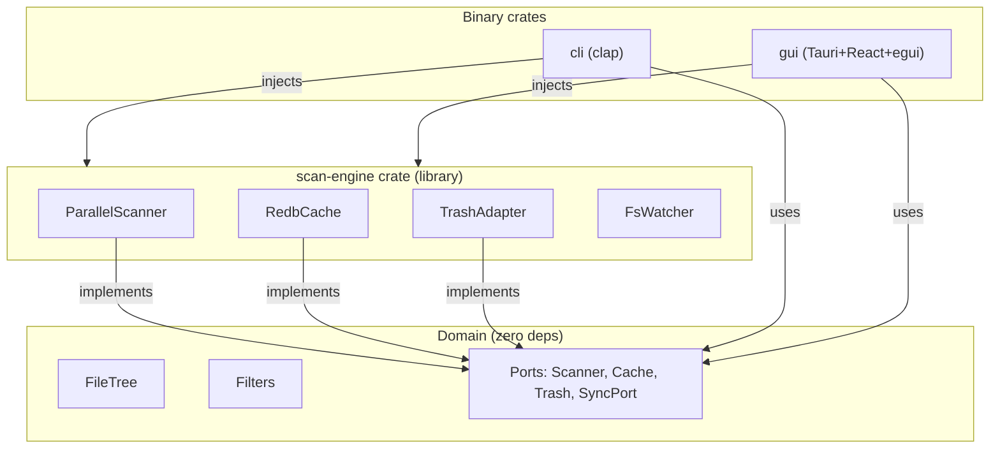

# DiskScope — Implementation Plan

## 1. PROBLEM & GOAL

**Problem:** No free, fast, cross-platform disk analyzer exists. Paid tools (DaisyDisk), platform-locked tools (WinDirStat, GrandPerspective), and slow TUI tools (ncdu) leave a gap.

**Goal:** Free, open-source disk space analyzer with parallel scanning (<2s for 100k files), interactive treemap, safe delete with undo, and cross-platform binaries (Linux/macOS/Windows).

---

## 1.5 LANGUAGE & TOOLCHAIN

**Language:** Rust, edition 2021. **MSRV:** 1.75 (stabilises `async fn` in traits). `Cargo.toml` sets `rust-version = "1.75"`.

**Why Rust:** Cross-platform single-binary with native perf, zero runtime, and ownership guarantees — no GC pauses during 100k-file scans. Alternatives rejected: Go (larger binaries, weaker compile-time guarantees for tree ownership), C++ (unsafe memory, slower iteration), Electron (100 MB+ runtime, high memory).

**Why Hexagonal:** Domain logic (tree building, filtering, file-type classification) has zero platform or I/O dependencies. Adapters (Tauri/CLI/scan-engine) plug in via trait ports — testable in isolation, swappable, no framework lock-in.

**Why these frameworks:**
- **Tauri v2 + egui:** 5–10 MB binary vs Electron's 100 MB+. egui renders treemaps on a native canvas via `egui_extras` — the requirements mandate egui+egui_extras for tables and treemaps, not React components.
- **jwalk 0.6 + rayon:** jwalk is the fastest parallel directory walker in Rust ecosystem; rayon provides work-stealing without async overhead for CPU-bound walk+stat.
- **redb 2.1:** Single-file embedded ACID DB, Rust-native, no external server — ideal for scan caching.
- **clap 4.5:** De facto Rust CLI framework, derive macros, shell completions.
- **trash 4.0:** Cross-platform move-to-trash (Linux FreeDesktop, macOS Finder Trash, Windows Recycle Bin).
- **Ably 1.0 (optional, feature-gated):** OSS-licensed SDK (MIT), free tier available (6k msgs/min), app works fully offline without an Ably key. Enforced: no data leaves the device unless user explicitly enables sync.

**Linting & formatting (enforced in CI and pre-commit):**
- Rust: `#![deny(clippy::all)]`, `#![deny(missing_docs)]`, `cargo clippy`, `cargo fmt --check`
- TypeScript: `strict: true`, `noImplicitAny: true`, `strictNullChecks: true`
- Frontend: `eslint`, `prettier --check`
- Commit lint: `commitizen` + `pre-commit` hooks

**Commit workflow:** Conventional Commits (`type(scope): imperative`), one logical change per commit. Examples: `feat(scan): add parallel walk with rayon`, `fix(gui): handle null path in treemap`. Enforced via commitizen in pre-commit.

**Performance constants (used in perf tests, not literals):**
```rust
const MAX_SCAN_DURATION_MS: u64 = 2_000;   // 100k files on SSD
const MAX_MEMORY_DURING_SCAN_MB: u64 = 200;
const MAX_TREEMAP_RENDER_MS: u64 = 100;
```

**Test commands (Gate 1 matrix):**
```
cargo test --workspace          # Rust unit + integration + perf
cd crates/gui/frontend && npx vitest run  # Frontend unit
cd crates/gui/frontend && npx playwright test  # E2E
```

**Privacy constraint (from requirements):** No telemetry without explicit consent. When sync is enabled, only `ScanResult` aggregates (totals, directory tree) are transmitted — never raw file paths or contents. Ably channel names use opaque hashes, not filesystem paths.

---

## 2. ARCHITECTURE

### 2.1 High-Level Architecture



**Adapter terminology:** "Adapters" in hexagonal architecture means any component that implements a domain port or consumes the domain. In DiskScope: `scan-engine` crate contains **crate-level adapters** (ParallelScanner, RedbCache, TrashAdapter, FsWatcher) that implement domain traits. `cli` and `gui` are **binary-level adapters** that wire the ports together and provide user-facing I/O. Domain never depends on any adapter.

### 2.2 Workspace Layout

```
Cargo.toml           # workspace root
crates/
  domain/            # pure domain — ZERO external deps
  scan-engine/       # Scanner, Cache, Trash adapters
  cli/               # clap binary
  gui/               # Tauri binary + React frontend in gui/frontend/
```

### 2.3 Module Boundaries

| Module | Responsibility | Depends On |
|---|---|---|
| `domain/` | FileNode, FileType, ScanResult, Filters, TreeBuilder, ports (Scanner, Cache, Trash) | nothing |
| `scan-engine/` | Parallel walker, redb cache, trash adapter, FS watcher | `domain/`, rayon, jwalk, redb, trash, ignore, notify |
| `cli/` | CLI binary: scan, summary, completions | `domain/`, `scan-engine/`, clap |
| `gui/` | Tauri shell + React chrome + egui canvas views | `domain/`, `scan-engine/`, tauri, egui |

**Crate dependency graph (library crates only):**
```
domain  ←  scan-engine  ←  cli
                         ←  gui
```
`domain` is a pure library with zero deps. `scan-engine` is a library that implements domain ports. `cli` and `gui` are binary crates that depend on both. `scan-engine` never depends on `cli` or `gui`.

### 2.4 Key Ports (Domain Defines, Adapters Implement)

```rust
pub trait Scanner {
    fn scan(&self, root: &Path, filters: &Filters) -> Result<ScanResult, DomainError>;
}

pub trait Cache {
    fn get(&self, path: &Path) -> Option<CachedEntry>;
    fn put(&mut self, entry: &CachedEntry) -> Result<(), DomainError>;
    fn invalidate(&mut self, path: &Path) -> Result<(), DomainError>;
}

pub trait Trash {
    fn delete(&self, path: &Path) -> Result<TrashReceipt, DomainError>;
    fn undo(&self, receipt: &TrashReceipt) -> Result<(), DomainError>;
}

/// Sync port — optional. All callbacks are `Send + Sync` for cross-thread use.
/// Returns `Result` on all mutating operations. Offline-queue: adapter buffers
/// messages in a local queue (file-backed) when disconnected; flushes on reconnect.
pub trait SyncPort: Send + Sync {
    fn publish_scan(&self, result: &ScanResult) -> Result<(), DomainError>;
    fn subscribe_scans(&self, callback: Box<dyn Fn(Result<ScanResult, DomainError>) + Send + Sync>) -> Result<(), DomainError>;
    fn resolve_conflict(&self, local: &ScanResult, remote: &ScanResult) -> Result<ScanResult, DomainError>;
    fn is_connected(&self) -> bool;
}
```

**Async safety note:** The `Scanner` trait is intentionally **synchronous** — it blocks the calling thread (rayon owns the thread pool). No `async fn` in domain traits, no `async-trait` dependency, no object-safety issues. Async I/O is an adapter concern only.

### 2.5 Data Flow

```
User selects path → CLI/GUI calls Scanner::scan(path, filters)
  → scan-engine parallel-walks (rayon+jwalk) respecting .gitignore
  → checks Cache (redb) for unchanged nodes
  → builds FileTree → applies Filters → returns ScanResult
  → CLI formats output / GUI renders treemap + table
```

---

## 3. PHASES

**TDD workflow (applies to every phase):** Tests are written FIRST (RED), then minimal implementation (GREEN), then refactor. One TDD cycle = one commit. Test names follow `should <behavior> when <condition>` convention. No "test later" — tests precede implementation. Per GUIDELINES.md §4.2.

### Phase 1 — Domain Core (~2 days)

**Goal:** Pure domain logic. Zero external deps. All types, value objects, domain services, and port traits.

**Deliverables:**
- `crates/domain/` crate (lib)
- `FileNode` struct: path, name, size, file_type, modified, children
- `FileType` enum: Audio, Video, Image, Doc, Code, Archive, Other
- `ScanResult` struct: root FileNode, total_size, file_count, scan_duration
- `Filters` struct: min_size, max_size, file_types, min_age, max_depth, name_pattern
- `TreeBuilder` service: build tree from flat entries, aggregate sizes
- `FilterEngine` service: apply filters to ScanResult, return pruned tree
- Ports: `Scanner`, `Cache`, `Trash` traits
- `DomainError` enum: Io, PermissionDenied, NotFound, InvalidPath, CacheCorrupt
- `file_type_from_ext()` — map extension to FileType (used by scan-engine and CLI)

**Tests (TDD order):**

| # | Test | Type |
|---|---|---|
| 1 | should create FileNode with all fields when given valid input | unit |
| 2 | should classify file type from extension when extension is known | unit |
| 3 | should classify as Other when extension is unknown | unit |
| 4 | should build tree from flat entries when entries are unsorted | unit |
| 5 | should aggregate parent directory size when children exist | unit |
| 6 | should apply min_size filter when filter is set | unit |
| 7 | should apply file_type filter when type list is non-empty | unit |
| 8 | should apply name_pattern filter when pattern matches | unit |
| 9 | should apply combined filters when multiple are set | unit |
| 10 | should return empty ScanResult when directory is empty | unit |
| 11 | should return DomainError::NotFound when path does not exist | unit |
| 12 | should sort children by size descending when building tree | unit |

**Gates satisfied:** Gate 1 (unit tests pass)

---

### Phase 2 — Scan Engine Adapter (~3 days)

**Goal:** Implement Scanner, Cache, and Trash ports. Parallel walk, redb caching, incremental scan.

**Deliverables:**
- `crates/scan-engine/` crate (lib)
- `ParallelScanner` — implements `Scanner` via rayon + jwalk, respects .gitignore
- Public API takes `&dyn Scanner` (or generic `impl Scanner`) — callers inject the scanner; `lib.rs` never constructs `ParallelScanner` internally
- `RedbCache` — implements `Cache` via redb embedded DB
- `TrashAdapter` — implements `Trash` via trash crate
- `IncrementalScanner` — re-walks, uses cache for unchanged metadata (mtime + size match)
- `scan_to_json()`, `scan_to_jsonl()`, `scan_to_table()`, `scan_to_tree()` — output formatters
- Progress callback: `Fn(path: &Path, files_scanned: u64)` for UI updates
- `FsWatcher` — wraps `notify` crate (cross-platform: inotify/FSEvents/ReadDirectoryChanges). Emits coarse-grained change events (created/modified/deleted) on a watched root. GUI subscribes to trigger incremental re-scan + UI refresh. Debounces rapid changes (250 ms default).

**Tests (TDD order):**

| # | Test | Type |
|---|---|---|
| 13 | should scan directory and return ScanResult when path is valid | integration |
| 14 | should respect .gitignore rules when scanning git repos | integration |
| 15 | should use cached entry when mtime and size match | integration |
| 16 | should invalidate cache entry when mtime or size differ | integration |
| 17 | should move file to trash when Trash::delete is called | integration |
| 18 | should restore file from trash when Trash::undo is called | integration |
| 19 | should output valid JSON when scan_to_json is called | unit |
| 20 | should output valid JSONL when scan_to_jsonl is called | unit |
| 21 | should output formatted table when scan_to_table is called | unit |
| 22 | should output indented tree when scan_to_tree is called | unit |
| 23 | should scan 100k files in under `MAX_SCAN_DURATION_MS` on modern hardware | perf |
| 24 | should use under `MAX_MEMORY_DURING_SCAN_MB` during scan of 100k files | perf |
| 25 | should invoke progress callback during scan | integration |
| 26 | should skip permission-denied directories without crashing | integration |
| 27 | should emit change event when watched directory is modified | integration |

**Fixture strategy for perf tests (tests 23–24):** Generate 100k-file tree in a temp directory at test time via `std::fs::create_dir_all` + `File::create` in a setup script (`tests/scripts/gen_fixtures.sh`). The fixture dir is `.gitignore`d and generated fresh in CI; never committed. Alternative: generate inline in Rust test setup for portability.

**Gates satisfied:** Gate 1 (unit + integration + perf tests pass)

---

### Phase 3 — CLI Adapter (~1 day)

**Goal:** Working CLI binary. `diskscope scan`, `diskscope summary`, `diskscope completions`.

**Deliverables:**
- `crates/cli/` crate (bin)
- `diskscope scan [path] --format table|json|jsonl|tree` — full scan with output format
- `diskscope summary <path>` — quick size summary (top N entries, total, file count)
- `diskscope completions <shell>` — shell completions (bash, zsh, fish, powershell)
- Flags: `--min-size`, `--max-size`, `--type`, `--depth`, `--pattern`
- Error messages are human-readable (no backtrace for user errors)

**Tests (TDD order):**

| # | Test | Type |
|---|---|---|
| 28 | should print table output when format is table | integration |
| 29 | should print valid JSON when format is json | integration |
| 30 | should print valid JSONL when format is jsonl | integration |
| 31 | should print indented tree when format is tree | integration |
| 32 | should filter by min_size when --min-size is set | integration |
| 33 | should generate completions for specified shell | integration |
| 34 | should exit with code 0 on success | integration |
| 35 | should exit with code 1 and print error when path invalid | integration |
| 36 | should print summary with top entries when summary is called | integration |

**Gates satisfied:** Gate 1 (integration tests pass)

---

### Phase 4 — GUI (Tauri + React + egui) (~8 days)

> **Note:** This is the highest-risk phase. Bundles Tauri setup, egui WASM bridge, React chrome, treemap+table rendering, keyboard shortcuts, context menus, and Playwright E2E. Allocate extra buffer if egui WASM integration proves complex.

**Goal:** Interactive desktop app. Treemap, tree/table view, filters, safe delete, keyboard shortcuts.

**Deliverables:**
- `crates/gui/` crate (bin) — Tauri v2 shell with IPC commands
- `gui/frontend/` — React 18 + TypeScript + Vite project
- egui WASM canvas: interactive treemap (`egui_extras::Treemap`) and sortable table (`egui_extras::TableBuilder`) — treemap and table are both rendered by egui, not React
- React chrome: toolbar, path selector, filter panel, status bar
- Tree/table view: egui_extras `TableBuilder` with sortable columns (name, size, modified, type)
- Filters UI: size range slider, file type checkboxes, age picker, pattern input
- Safe delete: `Delete` key or context menu → move to trash, `Ctrl/Cmd+Z` → undo
- Context menu: open in file explorer, copy path, copy to clipboard
- Keyboard nav: arrows, enter (drill in), backspace (drill out), delete (trash)
- Progress bar during scan (via progress callback from Phase 2)
- Tauri commands: `start_scan`, `get_results`, `apply_filters`, `delete_file`, `undo_delete`
- **egui WASM bridge:** egui compiles to `wasm32-unknown-unknown` and renders into a `<canvas>` element managed by React. React owns the DOM chrome (toolbar, panels); egui owns the canvas (treemap, table). Communication via `postMessage`/`CustomEvent` on the canvas element — React posts scan data + filter state into the canvas, egui posts selection/drag events out. Build: `wasm-pack build --target web` as a workspace build step. State sharing: Rust structs serialised via `serde` to JSON across the bridge; single source of truth lives in Rust.

**Tests (TDD order):**

| # | Test | Type |
|---|---|---|
| 37 | should start scan when path is selected | e2e |
| 38 | should display treemap when scan completes | e2e |
| 39 | should drill into directory when treemap node is clicked | e2e |
| 40 | should drill out when backspace is pressed | e2e |
| 41 | should move to trash when delete key is pressed | e2e |
| 42 | should restore file when Ctrl+Z is pressed after delete | e2e |
| 43 | should filter results when min_size slider is changed | e2e |
| 44 | should sort table when column header is clicked | e2e |
| 45 | should open context menu when right-clicking a file | e2e |
| 46 | should copy path to clipboard when context menu action selected | e2e |
| 47 | should show progress bar during active scan | e2e |
| 48 | should remain responsive during background scan | e2e |

**Gates satisfied:** Gate 1 (e2e tests pass), Gate 3 (visual + functional E2E via Playwright + vision model)

---

### Phase 5 — Packaging & Distribution (~3 days)

**Goal:** Cross-platform installers. CI/CD pipeline.

**Deliverables:**
- GitHub Actions workflow: build + test + package on Linux/macOS/Windows
- Linux: AppImage, .deb, .rpm, .tar.gz
- macOS: universal binary .dmg (notarized)
- Windows: MSI installer, portable .exe
- Tauri updater integration
- Code signing: macOS Developer ID, Windows EV cert (if available)

**Tests (TDD order):**

| # | Test | Type |
|---|---|---|
| 49 | should produce valid .deb when building for Linux | ci |
| 50 | should produce valid .dmg when building for macOS | ci |
| 51 | should produce valid .msi when building for Windows | ci |
| 52 | should produce valid AppImage when building for Linux | ci |
| 53 | should pass all gates (1-3) in CI before packaging | ci |

**Gates satisfied:** Gate 1 (CI tests pass), Gate 2 (adversarial review of final diff)

---

### Phase 6 — Real-time Sync (Post-MVP, Optional, ~3 days)

**Goal:** Multi-device scan sync via Ably. Feature-gated behind `sync` cargo feature.

**Deliverables:**
- `ably` dependency behind `sync` feature flag in `scan-engine`
- `AblySync` service: publish scan results, subscribe to updates
- Last-write-wins conflict resolution (timestamp-based)
- Live disk watcher: re-scan on file system change, push delta
- GUI: sync status indicator, device list

**Tests (TDD order):**

| # | Test | Type |
|---|---|---|
| 54 | should publish scan result to Ably channel when scan completes | integration |
| 55 | should receive scan update when another device publishes | integration |
| 56 | should resolve conflict with last-write-wins when timestamps differ | unit |
| 57 | should trigger re-scan when disk change is detected | integration |
| 58 | should show sync status in GUI when connected | e2e |

**Gates satisfied:** Gate 1

---

## 4. DESIGN DECISIONS

| Concern | Decision | Rationale |
|---|---|---|
| **Language** | Rust 2021, MSRV 1.75 | Native perf, no GC pauses during 100k-file scans, single cross-platform binary |
| **Architecture** | Hexagonal (domain + adapters) | Domain has zero platform deps; adapters are testable and swappable |
| **Why not Electron/Go** | Tauri + Rust | Tauri: 5–10 MB binary vs Electron's 100 MB+. Go: larger binaries, weaker compile-time tree ownership guarantees |
| **Domain purity** | Zero external deps in `domain/` | Hexagonal — domain doesn't know about disk, DB, or UI |
| **Parallel walk** | jwalk 0.6 + rayon | Fastest parallel walker in Rust; rayon work-stealing for CPU-bound walk+stat |
| **Caching** | redb 2.1 (embedded, ACID) | Single-file DB, no server, Rust-native, small binary |
| **GUI framework** | Tauri v2 + egui 0.31 WASM | Small binary vs Electron; egui_extras for treemap+table (requirements mandate) |
| **Why not DaisyDisk/ncdu** | Free, open-source, cross-platform | DaisyDisk: macOS-only, paid. ncdu: slow TUI, no treemap. WinDirStat: Windows-only |
| **File type mapping** | Extension-based in domain | Fast, deterministic, covers 99% of cases |
| **Error handling** | `DomainError` enum, no `unwrap()` | Explicit, composable, no panics in user-facing code |
| **Output formats** | Formatter functions in scan-engine | CLI and GUI both use same formatters; no duplication |
| **Trash** | trash 4.0 | Cross-platform move-to-trash (FreeDesktop, Finder, Recycle Bin) |
| **Sync** | Ably 1.0 behind feature flag | OSS SDK (MIT), free tier (6k msgs/min), optional; app works fully offline without key |
| **FS watcher** | notify crate (Phase 2) | Cross-platform (inotify/FSEvents/ReadDirectoryChanges); enables live UI refresh |

---

## 5. RISK ASSESSMENT

| Risk | Likelihood | Impact | Mitigation |
|---|---|---|---|
| egui WASM treemap perf on large trees | Medium | High | Virtualize: render only visible nodes; depth-limited preview |
| jwalk permission errors on Linux symlinks | Low | Medium | Catch + skip; log at debug level |
| redb corruption on crash during write | Low | High | WAL mode; re-validate on open; rebuild cache if corrupt |
| Tauri IPC overhead on frequent progress updates | Medium | Medium | Throttle progress callbacks to 100ms intervals |
| Cross-platform trash crate edge cases | Low | Medium | Test on all 3 platforms in CI; fallback to warning |
| 100k files scan <2s not achievable on HDD | Medium | Low | Document SSD requirement; still works on HDD, just slower |
| Code-signing cert procurement (macOS Dev ID, Windows EV) | Medium | High | Start procurement in Phase 1; costs ~$300/yr (Windows EV). Fallback: unsigned builds for v1.0, sign in v1.1. CI secret management via GitHub encrypted secrets. |
| Ably free-tier rate limits (6k msgs/min) exceeded | Low | Medium | Rate-limit publish to 1 msg/sec max; batch deltas; degrade gracefully (queue locally) |

---

## 6. PONYTAIL / KARPATHY COMPLIANCE CHECKLIST

- [x] **Architecture** — Hexagonal, domain at center, adapters at edges
- [x] **Dependencies** — Domain has ZERO external deps
- [x] **Types** — All public structs/enums/traits documented, no `unwrap()` in production
- [x] **TDD** — Tests listed in order per phase, test-first
- [x] **Karpathy** — Explicit types, small functions, no cleverness, explicit errors
- [x] **Conventional Commits** — `feat(scan):`, `fix(gui):`, `refactor(domain):`
- [x] **Small increments** — One phase = one logical unit; one test = one commit cycle

---

## 7. GATE MAPPING

| Phase | Gate 0 (Plan) | Gate 1 (Tests) | Gate 2 (Review) | Gate 3 (Visual E2E) |
|---|---|---|---|---|
| Phase 1: Domain | this plan | ✅ unit tests 1–12 | after Phase 1 | — |
| Phase 2: Scan Engine | — | ✅ tests 13–27 | after Phase 2 | — |
| Phase 3: CLI | — | ✅ tests 28–36 | after Phase 3 | — |
| Phase 4: GUI | — | ✅ tests 37–48 | after Phase 4 | ✅ Playwright + vision |
| Phase 5: Packaging | — | ✅ CI tests | final review | — |
| Phase 6: Sync | — | ✅ tests 54–58 | if shipped | — |
