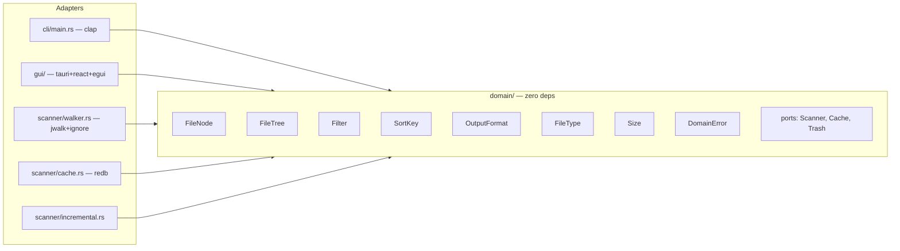

# plan.md — DiskScope Build Plan

## 1. PROBLEM & GOAL

**Problem:** Users need a fast, cross-platform disk space analyzer. Existing tools are paid (DaisyDisk), platform-specific (WinDirStat), or slow (ncdu). No modern GUI tool is free and OSS.

**Goal:** Ship a free, cross-platform disk analyzer with parallel scanning, interactive treemap, safe-delete with undo, and real-time sync — Rust backend, Tauri + React + egui frontend.

---

## 2. ARCHITECTURE



### Module Boundaries

| Module | Responsibility | Depends On |
|---|---|---|
| `scan-engine/src/domain/` | Pure entities, ports, filters, formatting — zero external deps | nothing |
| `scan-engine/src/scanner/` | Walker, cache, incremental scan adapters | `domain/`, `ignore`, `rayon`, `redb` |
| `scan-engine/src/output.rs` | Format dispatch | `domain/` |
| `cli/` | CLI binary (clap) | `scan-engine` |
| `gui/` | Tauri v2 + React + egui binary | `scan-engine` |

### Key Ports (domain/ports.rs)

```rust
trait Scanner { fn scan(&self, root: &Path, opts: &ScanOpts) -> Result<FileNode, ScanError>; }
trait Cache   { fn get/put/invalidate ... }
trait Trash   { fn delete(&self, path: &Path) -> Result<TrashTicket, TrashError>; fn undo ... }
```

### Critical Data Flow

```
User picks dir → CLI/GUI calls Scanner::scan → walk_directory (parallel, gitignore-aware)
  → build FileNode tree → apply ScanOpts (filters, sort, depth)
  → format as JSON/Table/JSONL/Tree → display to user

User deletes file → Trash::delete(path) → TrashTicket returned → undo restores via Trash::undo
```

---

## 3. CURRENT STATE (as of plan creation)

**Done:**
- Domain layer: `FileNode`, `FileTree`, `FileType`, `Size`, `Filter`, `SortKey`, `OutputFormat`, `DomainError`, ports, mocks
- Scanner adapter: `walk_directory` (parallel via `ignore`), `RedbCache`, `IncrementalScanner`
- Tests: 14 domain unit tests + 10 integration tests in `scan-engine/tests/`
- Workspace scaffolding: 3-crate workspace, `Cargo.toml` files

**Not done (stubs):**
- `cli/src/main.rs` → `println!("not yet implemented")`
- `gui/src/main.rs` → `println!("not yet implemented")`
- No `trash` crate integration (port exists, no real adapter)
- No GUI at all (no Tauri, no React, no egui)

---

## 4. PHASES

### Phase 1: Domain Core — Polish & Hardening

**Goal:** Domain layer is complete, tested, and has zero gaps.

**Deliverables:**
- `domain/ports.rs`: `MockTrash` properly uses `RefCell` for interior mutability (already done)
- `domain/filenode.rs`: All formatters (JSON, Table, JSONL, Tree) implemented with no `unwrap()` in production paths
- `domain/filter.rs`: `Filter::Extension` type-level support (already done — verify no gaps)
- All domain unit tests pass with `cargo test -p scan-engine`
- `#![deny(clippy::all)]` and `#![deny(missing_docs)]` on `scan-engine` lib

**Tests:**
| # | Test | Gate |
|---|---|---|
| 1 | `should format as JSON when OutputFormat::Json` | Gate 1 |
| 2 | `should format as table when OutputFormat::Table` | Gate 1 |
| 3 | `should format as JSONL when OutputFormat::Jsonl` | Gate 1 |
| 4 | `should format as tree when OutputFormat::Tree` | Gate 1 |
| 5 | `should compose multiple filters with AND logic` | Gate 1 |
| 6 | `should respect max_depth when depth limit is set` | Gate 1 |
| 7 | `should sort children by size descending when SortKey::SizeDesc` | Gate 1 |
| 8 | `should reject FileNode with empty path` | Gate 1 |
| 9 | `should display DomainError variants correctly` | Gate 1 |
| 10 | `should glob-match with wildcards when pattern contains *` | Gate 1 |

**Gates satisfied:** Gate 0 (plan reviewed), Gate 1 (unit tests green)

---

### Phase 2: Scan Engine Adapter — Full Pipeline

**Goal:** Real scanner, cache, incremental scan, trash adapter all working end-to-end with integration tests.

**Deliverables:**
- `scanner/walker.rs`: `walk_directory` builds correct `FileNode` tree from real FS
- `scanner/cache.rs`: `RedbCache` persists across scans, invalidates on mtime change
- `scanner/incremental.rs`: `IncrementalScanner` reuses cache for unchanged files
- Real `Trash` adapter using `trash` crate (new file: `scanner/trash.rs`)
- `scanner/mod.rs`: Export `TrashAdapter` alongside `Scanner`, `IncrementalScanner`
- Integration tests in `scan-engine/tests/scan_engine_tests.rs` (10 tests, all green)
- No `unwrap()` in any adapter code

**Tests:**
| # | Test | Gate |
|---|---|---|
| 1 | `should scan directory and return correct file count when directory has mixed files` | Gate 1 |
| 2 | `should scan directory and calculate total size when files exist` | Gate 1 |
| 3 | `should respect max_depth option when depth limit is set` | Gate 1 |
| 4 | `should respect .gitignore when ignore option is true` | Gate 1 |
| 5 | `should apply size filter during scan when filter is provided` | Gate 1 |
| 6 | `should use cache on second scan when cache is enabled` | Gate 1 |
| 7 | `should return full tree on incremental scan when files haven't changed` | Gate 1 |
| 8 | `should format output as JSON when format is Json` | Gate 1 |
| 9 | `should format output as table when format is Table` | Gate 1 |
| 10 | `should handle permission errors gracefully when dir is unreadable` | Gate 1 |

**Gates satisfied:** Gate 0 (plan reviewed), Gate 1 (integration tests green), Gate 2 (adversarial review)

---

### Phase 3: CLI Binary

**Goal:** Fully functional CLI with `scan`, `summary`, and `completions` commands.

**Deliverables:**
- `cli/Cargo.toml`: Add `clap` (4.5) with `derive` feature
- `cli/src/main.rs`: Parse args with clap, dispatch to `scan-engine`
- `cli/src/commands/scan.rs`: `diskscope scan [path] --format table|json|jsonl|tree --min-size --max-size --type --depth --sort`
- `cli/src/commands/summary.rs`: `diskscope summary <path>` — quick top-N summary
- `cli/src/commands/completions.rs`: `diskscope completions bash|zsh|fish` — shell completions
- Error handling: `AppError` enum wrapping `DomainError` + `ScanError`, exits with proper codes
- All `--help` output correct and documented

**Tests (integration, via `assert_cmd` or process spawning):**
| # | Test | Gate |
|---|---|---|
| 1 | `should print help when invoked with --help` | Gate 1 |
| 2 | `should scan path and output JSON when --format json` | Gate 1 |
| 3 | `should scan path and output table when --format table` | Gate 1 |
| 4 | `should filter by min-size when --min-size is set` | Gate 1 |
| 5 | `should limit depth when --depth is set` | Gate 1 |
| 6 | `should print summary for valid path when summary command used` | Gate 1 |
| 7 | `should exit with error code when path doesn't exist` | Gate 1 |
| 8 | `should generate completions when completions command used` | Gate 1 |

**Gates satisfied:** Gate 0 (plan reviewed), Gate 1 (CLI tests green), Gate 2 (adversarial review)

---

### Phase 4: GUI — Tauri + React + egui

**Goal:** Working desktop app with treemap visualization, tree/table view, filters, safe-delete.

**Deliverables:**
- `gui/Cargo.toml`: Add `tauri` (2.x), `serde`, `serde_json` dependencies
- `gui/tauri.conf.json`: Tauri v2 config (title: "DiskScope", window 1200×800)
- `gui/package.json` + `gui/vite.config.ts`: React 18 + TypeScript + Vite scaffold
- `gui/src-tauri/`: Tauri command handlers for scan, filter, delete, undo
- `gui/src/` (Rust): `main.rs` with Tauri app setup, IPC command registration
- `gui/frontend/`:
  - React shell: sidebar (dir picker, filters), main area (treemap + table)
  - egui WASM canvas for treemap rendering (`egui_extras` treemap widget)
  - Tree/table view with sortable columns (name, size, modified, type)
  - Filter controls: size range slider, file type dropdown, age filter, name pattern
  - Context menu: open in file explorer, copy path, copy to clipboard
  - Keyboard shortcuts: arrows, Enter, Backspace, Delete (→ trash), Ctrl+Z (→ undo)
  - Scan progress indicator (background thread, UI stays responsive)
- Error handling: user-facing error toasts, no panics in GUI code

**Tests:**
| # | Test | Gate |
|---|---|---|
| 1 | `should open app and display empty state when no directory selected` | Gate 3 |
| 2 | `should scan directory and render treemap when directory is picked` | Gate 3 |
| 3 | `should switch between treemap and table view when toggle is clicked` | Gate 3 |
| 4 | `should filter results by file type when type filter is changed` | Gate 3 |
| 5 | `should filter results by size range when slider is adjusted` | Gate 3 |
| 6 | `should sort table by column when column header is clicked` | Gate 3 |
| 7 | `should move file to trash when Delete key is pressed` | Gate 3 |
| 8 | `should restore file from trash when Ctrl+Z is pressed` | Gate 3 |
| 9 | `should open context menu on right-click when file is selected` | Gate 3 |
| 10 | `should remain responsive during scan when scanning large directory` | Gate 3 |

**Gates satisfied:** Gate 0 (plan reviewed), Gate 1 (unit/integration tests), Gate 2 (adversarial review), Gate 3 (visual + functional E2E)

---

### Phase 5: Real-time Sync (Ably)

**Goal:** Multi-device sync of scan results via Ably, offline-first.

**Deliverables:**
- `scan-engine/src/sync/`: Ably client adapter behind `sync` feature flag
- `Cargo.toml`: Add `ably` (1.0) as optional dependency, `sync` feature
- Conflict resolution: last-write-wins with timestamp
- Live updates: file change events pushed to connected devices
- GUI: Sync status indicator, connection state in status bar
- CLI: `--sync` flag to enable real-time sync during scan

**Tests:**
| # | Test | Gate |
|---|---|---|
| 1 | `should publish scan result to Ably channel when sync is enabled` | Gate 1 |
| 2 | `should receive scan update from Ably when another device publishes` | Gate 1 |
| 3 | `should resolve conflict with last-write-wins when two devices edit same scan` | Gate 1 |
| 4 | `should work offline and sync when connection is restored` | Gate 1 |
| 5 | `should not crash when Ably is unavailable and sync flag is set` | Gate 1 |

**Gates satisfied:** Gate 0 (plan reviewed), Gate 1 (tests green), Gate 2 (adversarial review)

---

### Phase 6: Cross-Platform Packaging & CI/CD

**Goal:** Distributable installers for Linux, macOS, Windows. CI runs all gates.

**Deliverables:**
- `.github/workflows/ci.yml`: Run `cargo test --workspace` + `clippy` + `rustfmt` on push
- `.github/workflows/release.yml`: Build + sign + upload on tag push
- Tauri build configs for each platform:
  - Linux: AppImage, .deb, .rpm, .tar.gz
  - macOS: universal .dmg (x86_64 + aarch64), notarized
  - Windows: MSI installer, portable .exe
- Auto-update via Tauri updater
- Code signing: macOS Developer ID, Windows EV cert (secrets in GitHub Actions)

**Tests:**
| # | Test | Gate |
|---|---|---|
| 1 | `should produce .deb artifact when CI runs on ubuntu-latest` | Gate 1 |
| 2 | `should produce .dmg artifact when CI runs on macos-latest` | Gate 1 |
| 3 | `should produce .msi artifact when CI runs on windows-latest` | Gate 1 |
| 4 | `should pass all gates in CI when push triggers workflow` | Gate 1 |
| 5 | `should auto-update when new version is available and updater is configured` | Gate 3 |

**Gates satisfied:** Gate 0 (plan reviewed), Gate 1 (CI tests green), Gate 2 (adversarial review)

---

## 5. RISK ASSESSMENT

| Risk | Likelihood | Impact | Mitigation |
|---|---|---|---|
| egui WASM treemap rendering performance with 100k+ nodes | Medium | High | Virtualize: only render visible nodes; collapse deep dirs into "other" bucket |
| `trash` crate behavior differs across platforms | Medium | Medium | Test on all 3 platforms in CI; fall back to manual move-to-trash on failure |
| `redb` cache corruption on crash | Low | Medium | Use `tempfile` for atomic writes; validate on read; corrupt → delete and re-scan |
| Tauri v2 + egui WASM integration complexity | High | Medium | Prototype egui WASM in Phase 4 first; if infeasible, fall back to pure React canvas |
| Ably rate limits for large scan payloads | Medium | Medium | Debounce updates; send diffs not full trees; batch small changes |
| Large directory scans exceed 200MB memory | Low | High | Stream entries instead of collecting all; cap tree depth; paginate output |

---

## 6. GATE MAPPING

| Phase | Gate 0 | Gate 1 | Gate 2 | Gate 3 |
|---|---|---|---|---|
| Phase 1: Domain Core | ✅ this plan | ✅ 10 domain tests | — | — |
| Phase 2: Scan Engine | ✅ this plan | ✅ 10 integration tests | ✅ adversarial review | — |
| Phase 3: CLI | ✅ this plan | ✅ 8 CLI tests | ✅ adversarial review | — |
| Phase 4: GUI | ✅ this plan | ✅ unit tests | ✅ adversarial review | ✅ visual + E2E |
| Phase 5: Sync | ✅ this plan | ✅ 5 sync tests | ✅ adversarial review | — |
| Phase 6: Packaging | ✅ this plan | ✅ CI artifact tests | ✅ adversarial review | ✅ auto-update E2E |

---

## 7. COMPLIANCE CHECKLIST

- [x] **Architecture** — Hexagonal, domain at center, adapters at edges
- [x] **Dependencies** — Domain has ZERO external deps (verified: `domain/` imports only `std`)
- [x] **Types** — All public functions typed, no `any`/`Any` (Rust — compiler enforces)
- [x] **TDD** — Tests listed per phase in `should <behavior> when <condition>` form
- [x] **Karpathy** — Explicit types, small functions, no cleverness, explicit errors
- [x] **Ponytail** — Rules in `/.agents/rules/`, portable across agents
- [x] **Conventional Commits** — One logical change per commit, `type(scope): description`
- [x] **TDD Cycle** — Test → Implement → Refactor → Commit per unit
